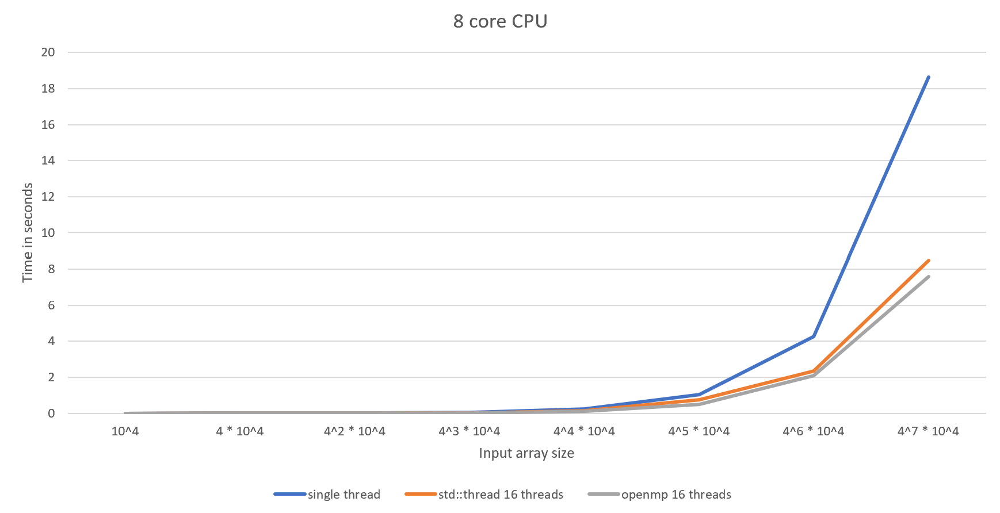

# parallel-quicksort

This is a project I made for the Parallel Programming course at Theoretical Computer Science @ Jagiellonian University. I compare three QuickSort implementations - single thread version, std::thread parallel version, and OpenMP parallel version.

## std::thread version
Here I distribute the top recursive calls among separate threads up to the max_depth parameter.
For example, given max_depth == 1, the first quicksort call will create two threads, one for each subarray.
Given max_depth == 2, the first call will create two threads, then these two threads will create two threads each. In this case, four active threads will sort their respective subarrays in parallel.
As you can see, the number of active threads sorting the array in parallel is 2^max_depth.

## OpenMP version
In the previous version threads above the max_depth level of recursion were idle. Here I use the omp task pragma, to make sure that no thread is Idle.
For every recursive quicksort call bigger than the min_parallel_size parameter I create a task. This task is then picked up by one of the waiting threads from the thread pool.

## Results
The diagram compares results on an 8-core CPU for the standard version, the std::thread version with 16 active threads (max_depth of 4), and the OpenMP version with 16 threads.

## Usage

Run `./generate.py` to generate input. This might take a few minutes.

Run `./clean.py` to clean generated input and output.

Run `./test_correctness.py` to test if sorting algorithms are correct.

Run `./test_performance.py` to compare the performance of the algorithms.
You can edit the configuration (number of threads and cores) in `test_performance.py` file.